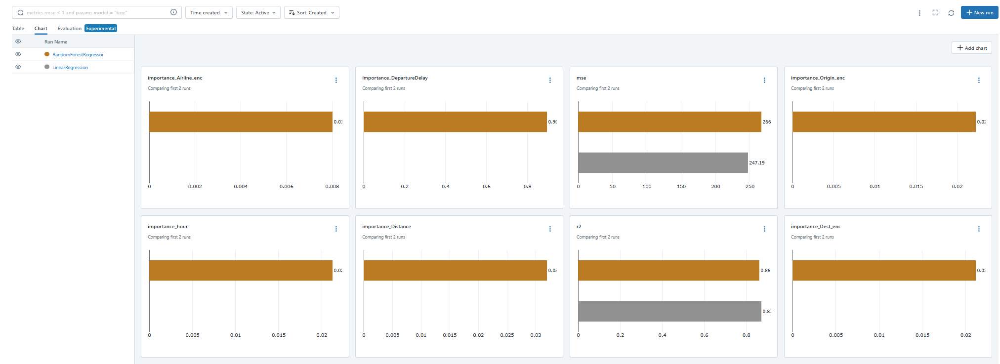

## Description

Построен lakehouse-пайплайн на Polars + Delta Lake для прогнозирования задержек авиарейсов.  
Использован датасет [Flight Delay 2018–2024](https://www.kaggle.com/code/peymanradmanesh/flight-delay-analysis-2018-2024), данные обрабатываются инкрементально с ежедневными батчами, очищаются, агрегируются и передаются в модели регрессии (LinearRegression и RandomForestRegressor), метрики логируются в MLflow.

## To run

    docker-compose up --build

После завершения пайплайна MLflow UI доступен по адресу http://localhost:5000.

## Results

